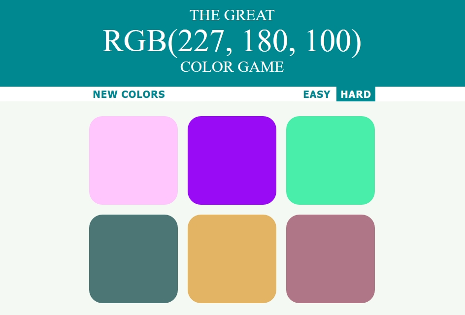

# Color-Game

This is an interactive game to learn the RGB color model. It is written using pure vanilla JavaScript, HTML, and CSS.

This game is designed to quickly teach the RGB color model by rapidly generating new colors after every correct guess.

